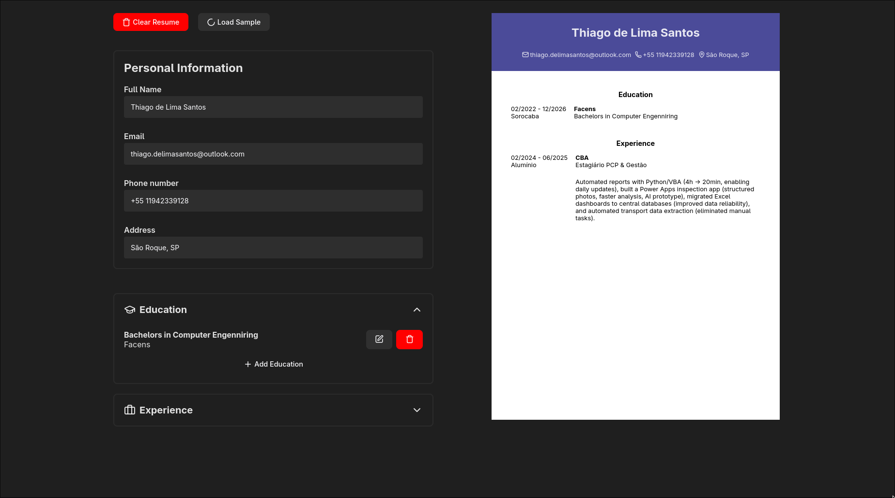

# CV Generator

This project was developed as part of **[The Odin Project](https://www.theodinproject.com/)** React curriculum.  
The main objective was to build a **CV Generator** using React, where users can input their information and instantly preview a structured CV.

## ✨ Features
- 📝 Interactive form to add and edit personal, educational, and professional information  
- 👀 Real-time CV preview  
- 📄 Simple and clean layout  

## 🚀 Demo
👉 [Live Demo Here](https://cv-application-thiago.vercel.app/)  

## 📸 Screenshot

## 🛠️ Built With
- ⚛️ [React](https://reactjs.org/)  
- 🖼️ HTML5  
- 🎨 CSS3  

## 📂 Project Structure
- **Control Section** – Input forms where the user enters personal, education, and experience details  
- **Visualization Section** – Displays the CV in a professional layout  
